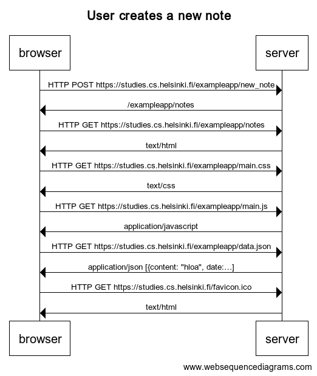

```
title User creates a new note

browser->server: HTTP POST https://studies.cs.helsinki.fi/exampleapp/new_note
server->browser: /exampleapp/notes

browser->server: HTTP GET https://studies.cs.helsinki.fi/exampleapp/notes
server->browser: text/html

browser->server: HTTP GET https://studies.cs.helsinki.fi/exampleapp/main.css
server->browser: text/css

browser->server: HTTP GET https://studies.cs.helsinki.fi/exampleapp/main.js
server->browser: application/javascript

browser->server: HTTP GET https://studies.cs.helsinki.fi/exampleapp/data.json
server->browser: application/json [{content: "hloa", date:…]

browser->server: HTTP GET https://studies.cs.helsinki.fi/favicon.ico
server->browser: text/html
```



[Link to diagram](https://www.websequencediagrams.com/cgi-bin/cdraw?lz=dGl0bGUgVXNlciBjcmVhdGVzIGEgbmV3IG5vdGUKCmJyb3dzZXItPnNlcnZlcjogSFRUUCBQT1NUIGh0dHBzOi8vc3R1ZGllcy5jcy5oZWxzaW5raS5maS9leGFtcGxlYXBwL25ld18ASgUAPwYtPgBPBzogABkNb3RlcwBaGEdFAEQtAEYFAF0RdGV4dC9odG1sACBGbWFpbi5jcwBRGGNzAIEHRwBjBWoAgT0TYXBwbGljYXRpb24vamF2YXNjcmlwdACBfUZkYXRhLmpzb24AWB9zb24gW3tjb250ZW50OiAiaGxvYSIsIGRhdGU64oCmXQCDFjtmYXZpY29uLmljbwCDMBw&s=default)

