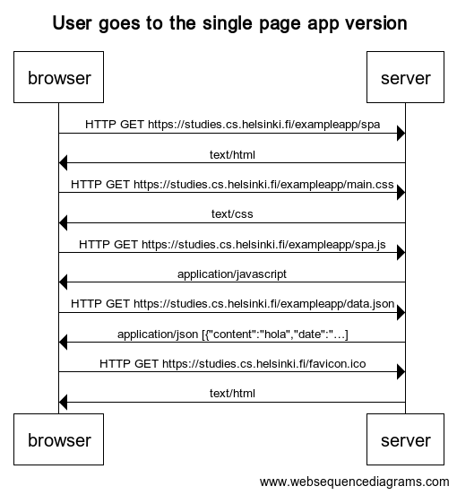

```
title User goes to the single page app version

browser->server: HTTP GET https://studies.cs.helsinki.fi/exampleapp/spa
server->browser: text/html

browser->server: HTTP GET https://studies.cs.helsinki.fi/exampleapp/main.css
server->browser: text/css

browser->server: HTTP GET https://studies.cs.helsinki.fi/exampleapp/spa.js
server->browser: application/javascript

browser->server: HTTP GET https://studies.cs.helsinki.fi/exampleapp/data.json
server->browser: application/json [{"content":"hola","date":"…]

browser->server: HTTP GET https://studies.cs.helsinki.fi/favicon.ico
server->browser: text/html
```



[Link to diagram](https://www.websequencediagrams.com/cgi-bin/cdraw?lz=dGl0bGUgVXNlciBnb2VzIHRvIHRoZSBzaW5nbGUgcGFnZSBhcHAgdmVyc2lvbgoKYnJvd3Nlci0-c2VydmVyOiBIVFRQIEdFVCBodHRwczovL3N0dWRpZXMuY3MuaGVsc2lua2kuZmkvZXhhbXBsZWFwcC9zcGEKADkGLT4ASQc6IHRleHQvaHRtbAAeRm1haW4uY3NzAFIXY3NzAIEDSS5qAFMTYXBwbGljYXRpb24vamF2YXNjcmlwdACBekZkYXRhLmpzb24AWB9zb24gW3siY29udGVudCI6ImhvbGEiLCJkYXRlIjoi4oCmXQCDFjtmYXZpY29uLmljbwCDMhw&s=default)