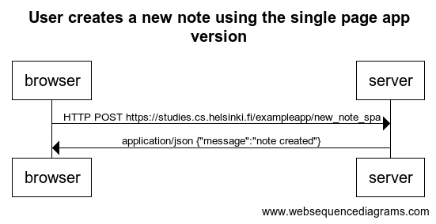

```
title User creates a new note using the single page app version

browser->server: HTTP POST https://studies.cs.helsinki.fi/exampleapp/new_note_spa
server->browser: application/json {"message":"note created"}
```



[Link to diagram](https://www.websequencediagrams.com/cgi-bin/cdraw?lz=dGl0bGUgVXNlciBjcmVhdGVzIGEgbmV3IG5vdGUgdXNpbmcgdGhlIHNpbmdsZSBwYWdlIGFwcCB2ZXJzaW9uCgpicm93c2VyLT5zZXJ2ZXI6IEhUVFAgUE9TVCBodHRwczovL3N0dWRpZXMuY3MuaGVsc2lua2kuZmkvZXhhbXBsZWFwcC9uZXdfbm90ZV9zcGEKAEMGLT4AUwc6IGFwcGxpY2F0aW9uL2pzb24geyJtZXNzYWdlIjoiAIEjBQCBNQZkIn0K&s=default)


